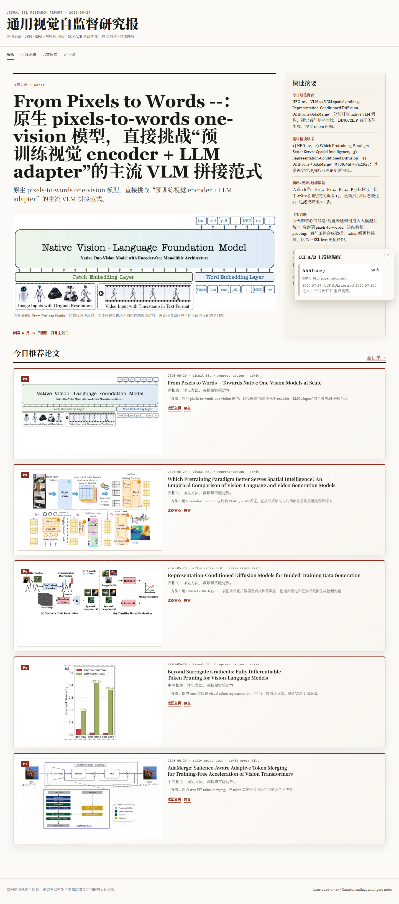

# Paper Digest Publisher Skill

An open Codex skill for building topic-specific research paper digests, with safe deduplication, Markdown reporting, optional MinerU figure extraction, and a reusable static website template.

It is not limited to visual self-supervised learning. Define a topic profile, then use the same workflow for vision, NLP, agents, robotics, systems, benchmarks, or any other research area.



The screenshot above is an example digest site generated for a visual self-supervised learning topic. The skill itself is generic.

## What You Can Configure

| Area | Examples |
| --- | --- |
| Topic | General visual pretraining, LLM agents, diffusion models, AI systems, retrieval, evaluation benchmarks |
| Scope include | Methods, venues, keywords, authors, tasks, project pages, code releases |
| Scope exclude | Narrow vertical domains, weakly related applications, repeated benchmark-only updates |
| Source tiers | arXiv, OpenReview, conference pages, workshop pages, official accepted-paper lists, project pages |
| Priority rubric | Custom meaning of P0/P1/P2/P3/scan-only for the topic |
| Report shape | Required summary table, reading route, paper index, trend notes, detailed entries |
| Publishing | Local Markdown, Feishu/Lark Markdown sync, static HTML, GitHub Pages |
| Website style | Use an existing site builder or adapt `assets/web-template/` |

## Topic Profile Example

```yaml
topic_name: "General Vision Pretraining"
retrieval_window: "last 24-48 hours"
scope_include:
  - image/video pretraining
  - vision foundation models
  - masked modeling
  - contrastive learning
  - distillation and representation learning
scope_exclude:
  - medical-only applications
  - remote-sensing-only applications
  - industrial inspection unless the method transfers
source_tiers:
  - conference and workshop pages
  - OpenReview
  - arXiv new and updated papers
priority_rubric:
  P0: "Read first; directly changes the core topic"
  P1: "Strong adjacent or high-signal status change"
  P2: "Useful but less urgent"
  P3: "Record or scan"
outputs:
  markdown_dir: "path/to/reports"
  site_dir: "path/to/static-site"
  github_pages: true
```

## Repository Layout

| Path | Purpose |
| --- | --- |
| `SKILL.md` | Codex skill entry point and core workflow |
| `references/workflow.md` | Detailed reporting, dedupe, ranking, MinerU, and publishing checks |
| `references/security.md` | What must never be committed |
| `scripts/parse_paper_index.py` | Extract priorities, titles, types, and arXiv IDs from a report index |
| `scripts/prepare_mineru_batch.py` | Prepare indexed PDFs and clear stale preview fallback assets before MinerU |
| `scripts/validate_digest_site.py` | Validate static site output and image coverage |
| `scripts/scan_for_secrets.py` | Scan for obvious token and secret patterns before publishing |
| `assets/web-template/` | Copyable HTML/CSS/JS template for a paper digest site |

## Website Template

`assets/web-template/` is a small static site that an AI agent can copy into a project and adapt. It includes:

- a digest homepage
- featured paper hero area
- priority and topic filters
- search over paper cards
- trend and archive sections
- sample `data/papers.json`
- placeholder figure asset

To adapt it, replace `assets/web-template/data/papers.json` with generated digest data and swap image paths for MinerU-extracted figures or other stable public assets.

## Safe Publishing Rules

Never commit:

- API keys or GitHub tokens
- MinerU JWTs or local MinerU config
- Feishu/Lark app secrets, access tokens, refresh tokens, or file tokens
- generated paper PDFs
- private reports
- MinerU extraction outputs from private runs

Before pushing a public repo:

```bash
python scripts/scan_for_secrets.py --root .
git status --short
git diff --cached --stat
```

## Example Prompt

```text
Use $paper-digest-publisher-skill to generate and publish a paper digest for
LLM agents for software engineering. Focus on the last 48 hours, prioritize
papers with reusable agentic coding methods, downgrade narrow product-only
case studies, and publish a Markdown report plus a static website.
```

## License

MIT
